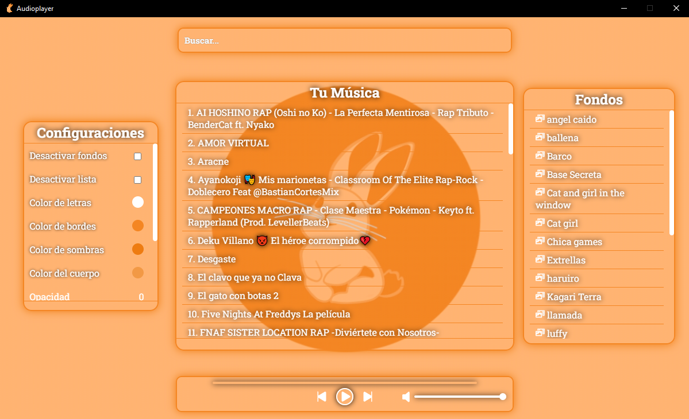
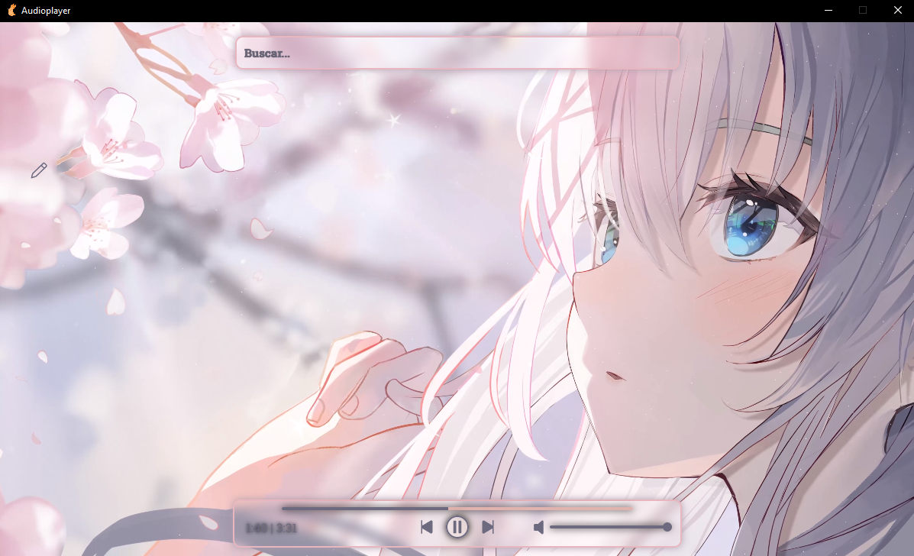

## AudioPlay

Anime Theme Audio Player

## Tech Stack

**Client:** React

**Server:** Tauri, Sqlite

## Run Locally

Clone the project

```bash
  git clone https://github.com/Corro-Kun/Audioplayer.git
```

Go to the project directory

```bash
  cd Audioplayer
```

Install dependencies

```bash
  npm install
```

Start the app

```bash
  npm run tauri dev
```

## Screenshots


<br>
<br>

<br>
<br>

<br>
<br>

<br>
<br>



<p align="left"><strong><samp>「</samp></strong></p>

<p align="center">
    <b>
        AudioPlay
        <br>
        Anime Theme Audio Player
        <br>
        <br>
        
        <br>
        <br>
        images of the application:
        <br>
        <br>
        
        <br>
        <br>
        
        <br>
        <br>
        
        <br>
        <br>
        
        <br>
        <br>
        
        <br>
        <br>
        ~ Corro-Kun ~
    </b>
</p>

<p align="right"><strong><samp>」</samp></strong></p>

<br>
