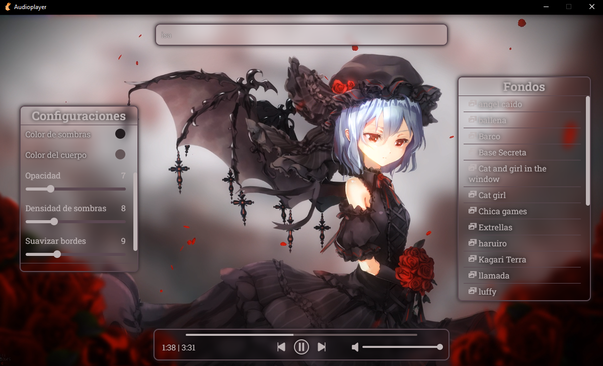
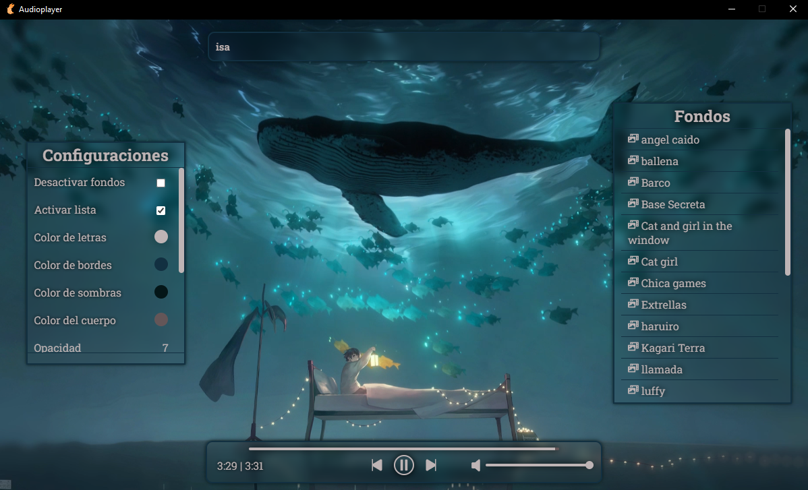

## AudioPlay

Anime Theme Audio Player

## Tech Stack

**Client:** React

**Server:** Tauri, Sqlite


## Run Locally

Clone the project

```bash
  git clone https://github.com/Corro-Kun/Audioplayer.git
```

Go to the project directory

```bash
  cd Audioplayer
```

Install dependencies

```bash
  npm install
```

Start the app

```bash
  npm run tauri dev
```

## Screenshots


<br>
<br>

<br>
<br>

<br>
<br>

<br>
<br>


## Color Reference

| Color             | Hex                                                                |
| ----------------- | ------------------------------------------------------------------ |
| Color Text |  #fff |
| Border Color |  #f48623 |
| Shadow Color |  #ee7c11 |
| Background Color |  #f29945 |

## Contributing

Contributions are always welcome!

See [CONTRIBUTING](CONTRIBUTING.md) for ways to get started.

# Thank you for reading
<p align="center">~ Corro-Kun ~</p>
